# bodyguard
> 🛡️ Cyberbullying Detection System

A machine learning-based project aimed at detecting and flagging potential cases of cyberbullying on Twitter. This system uses NLP and a web-integrated interface to promote safer online spaces by identifying harmful text-based interactions.

---

## 🚀 Project Goals

-   Detect cyberbullying in real-time using ML models.
-   Provide a browser-based warning overlay on harmful tweets.
-   Store analyzed tweets in a PostgreSQL database.
-   Enable real-time classification via REST API.

---

## 📅 Project Plan

### Month 1: Research & Data Preparation

-   **Week 1–2**: Research cyberbullying patterns, ML/NLP techniques.
-   **Week 3**: Finalize project scope, architecture, and tools.
-   **Week 4**: Collect and preprocess datasets.

### Month 2: Development & Deployment

-   **Week 1**: Build rule-based prototype.
-   **Week 2–3**: Train and evaluate ML models (e.g., BERT).
-   **Week 4**: Final testing, UI integration, and deployment.

---

## 📐 System Architecture

```mermaid
sequenceDiagram
    participant U as User on Twitter
    participant C as Content Script
    participant B as Background Script
    participant A as API Server (FastAPI)
    participant M as ML Model
    participant D as Database

    U ->> C: Tweet appears in DOM
    C ->> B: Send tweet text, author, ID
    B ->> A: POST /predict (text)
    activate A
    A ->> M: Run classification
    M -->> A: Return label
    A -->> B: Return classification result
    deactivate A
    B ->> D: POST /store (tweet + label)
    B -->> C: Return label
    C ->> U: Show "⚠️ Possible Cyberbullying" overlay (if flagged)
```



---

## 🧠 Machine Learning

-   Fine-tuned transformer-based models (e.g., `BERT`, `RoBERTa`)
-   Preprocessing: tokenization, cleaning, annotation
-   Evaluation metrics: `Precision`, `Recall`, `F1-Score`

---

## 🧩 Project Components

### 🧠 Backend: `FastAPI`

-   `/predict`: Returns classification label for a given tweet.
-   `/store`: Saves tweet and label into the database.

### 🌐 Frontend: Chrome/Firefox Extension

-   **Content Script**: Extracts tweet content from Twitter DOM.
-   **Background Script**: Sends content to backend and injects warning labels on tweets flagged as cyberbullying.

### 🛢️ Database: PostgreSQL

-   Stores tweet `id`, `author`, `text`, and predicted `label`.

---

## 🔧 Setup Instructions

### 📦 Dependencies

-   Python (FastAPI, Transformers, SQLAlchemy)
-   Node.js (for extension packaging, if needed)
-   PostgreSQL (with configured credentials)

### ⚙️ Backend

```bash
# Install dependencies
pip install -r requirements.txt

# Set environment and run FastAPI
python app.py
```

### 🧩 Browser Extension

1. Go to `chrome://extensions/`
2. Enable "Developer Mode"
3. Click "Load Unpacked" and select your extension directory.

---

## 🧪 API Usage

### POST `/predict`

**Request:**

```json
{
    "text": "You are so stupid and ugly"
}
```

**Response:**

```json
{
    "label": {
        "label": "cyberbullying",
        "confidence": 0.999
    }
}
```

### POST `/store`

**Request:**

```json
{
    "id": "123456",
    "author": "@example",
    "text": "You are so stupid and ugly",
    "label": "cyberbullying"
}
```

---

## ⚖️ Ethical Considerations

-   Not all offensive or negative content is cyberbullying.
-   System flags based on linguistic patterns, not intent.
-   Final judgments should involve human moderation in real applications.

---

## 📌 Future Improvements

-   Add user feedback to improve model performance.
-   Enable support for image/multimodal content.
-   Improve multilingual support.
-   Real-time streaming with Twitter API v2 (if accessible).

---

## 📝 License

This project is for educational and advocacy purposes. Use responsibly.
