```mermaid
sequenceDiagram
    participant U as User on Twitter
    participant C as Content Script
    participant B as Background Script
    participant A as API Server (FastAPI)
    participant M as ML Model
    participant D as Database

    U ->> C: Tweet appears in DOM
    C ->> B: Send tweet text, author, ID
    B ->> A: POST /predict (text)
    activate A
    A ->> M: Run classification
    M -->> A: Return label
    A -->> B: Return classification result
    deactivate A
    B ->> D: POST /store (tweet + label)
    B -->> C: Return label
    C ->> U: Show "⚠️ Possible Cyberbullying" overlay (if flagged)
```

# bodyguard
> 🛡️  **Cyberbullying Detection System (Advocacy Project)**

This project aims to reduce cyberbullying on social media platforms by detecting harmful content in real-time using Natural Language Processing (NLP) and machine learning. The focus is on text-based tweets, analyzed through a browser extension and a backend ML service.

## 🧠 Objective

Design and deploy a system that:

- Detects potential cyberbullying in tweets.
- Flags tweets with warnings in the user interface.
- Stores flagged data for analysis and improvement.

## 🗓️ Project Plan

### Month 1 – Research, Planning, and Data Collection

**Weeks 1-2:**

- Research cyberbullying definitions and patterns.
- Study prior ML approaches in NLP tasks (text classification, sentiment analysis).

**Week 3:**

- Define scope: Detect offensive content in Twitter text.
- Choose models (e.g., BERT, RoBERTa).
- Set up Python, Transformers, TensorFlow/PyTorch.

**Week 4:**

- Collect datasets (Twitter Sentiment, Hateful Memes, etc.).
- Preprocess and annotate the text data.

### Month 2 – Development, Testing, and Deployment

**Week 1:**

- Build a rule-based prototype using keyword matching/sentiment scoring.

**Weeks 2–3:**

- Fine-tune a transformer-based classifier (e.g., RoBERTa).
- Compare models and tune hyperparameters.
- Create a frontend overlay for flagged tweets.

**Week 4:**

- Evaluate the model (precision, recall, F1-score).
- Integrate feedback and finalize the system.

## 📦 Tech Stack

- **Frontend:** Browser Extension (Vanilla JS, DOM API)
- **Backend:** FastAPI, PostgreSQL, Docker
- **ML:** Transformers (RoBERTa), PyTorch
- **Deployment:** Docker Compose

## ⚙️ Architecture Overview

### Sequence Diagram



### Component Diagram


## 📊 Model Training

- Dataset: Preprocessed Twitter-like text, binary labels.
- Model: `roberta-base` fine-tuned with class weights for imbalance.
- Metrics: Accuracy, F1-score.
- Output: Saved model artifacts and tokenizer for inference.

## 🧪 Evaluation

- Weighted loss used to handle class imbalance.
- F1-score prioritized to minimize false negatives.
- Model deployed behind a FastAPI endpoint `/predict`.

## 🔐 Privacy & Ethics

- Does **not** store any personally identifiable information (PII).
- Data is stored locally/internally and not shared externally.
- Intended as an advocacy/proof-of-concept tool only.

## 🚀 Deployment

1. Clone the repository.
2. Run `python engine/train.py` to train model using dataset
3. Set up `.env` with PostgreSQL credentials.
4. Run: `docker-compose up --build`
5. Add extension to Browser from the `/extension/` directory.
6. Start browsing Twitter—flagged tweets will appear with a warning banner.

## 🧰 API Reference

### POST `/predict`

**Request:**

```json
{
    "text": "You are so stupid and ugly"
}
```

**Response:**

```json
{
    "label": {
        "label": "cyberbullying",
        "confidence": 0.999
    }
}
```

---

### POST `/store`

**Request:**

```json
{
    "id": "123456",
    "author": "@user",
    "text": "example tweet",
    "label": "cyberbullying"
}
```

**Response:**

```json
{
    "status": "stored"
}
```

## 📁 Project Structure

```plaintext
.
├── extension/              # Browser extension files
├── engine/
│   ├── app.py              # FastAPI server
│   ├── config.yaml         # Configs for DB and server
│   ├── predict.py          # Inference logic
│   ├── model/              # Saved model + tokenizer
│   ├── data/               # Processed dataset
│   ├── train.ipynb         # Training script (Jupyter Notebook)
│   └── train.py            # Training script
├── docker-compose.yml
```

## 💡 Future Improvements

- Add image and video support.
- Add multilingual support.
- Real-time moderation dashboard.
- User feedback integration loop for false positives/negatives.

## 🙌 Acknowledgements

- HuggingFace Transformers
- OLID (Offensive Language Identification Dataset)
- Jigsaw (Toxic Comment Classification Challenge)
- Open-source contributors working on online safety and NLP

---

**Author:** Abenezer Adane  
**Version:** 1.0 – Advocacy Proof-of-Concept  
**License:** This project is for educational and advocacy purposes. Use responsibly.
